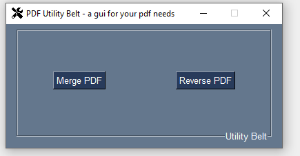
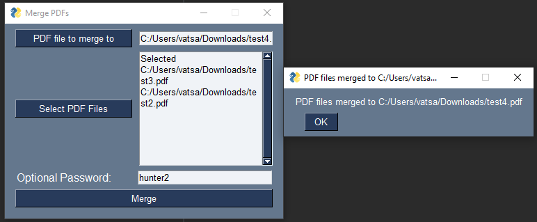

# PDF utility belt

### *A gui for your pdf needs*

**Currently, has support for merging and reversing pdfs**

Made using PySimpleGui and pikepdf





Requires: python >= 3.10 and poetry

Instructions:

```commandline
poetry install
poetry run python -m pdf_utility_belt
```